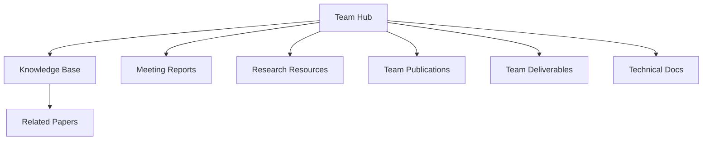

# EO-PERSIST Team Documentation Hub

Welcome to our team's central knowledge base and documentation hub for the EO-PERSIST project. This vault serves as our collaborative workspace for sharing knowledge, storing documentation, and managing project resources.

## Project Structure

### Knowledge Base
- [[Knowledge Base/index|Knowledge Base]] - Shared knowledge repository and technical documentation
  - [[Knowledge Base/Papers/index|Related Publications]] - Research papers and literature
- [[Knowledge Base/Project Info/index|Project Information]] - Project details and consortium
- [[Knowledge Base/Domain Knowledge/index|Domain Knowledge]] - Scientific and technical knowledge

### Project Planning
- [[Team Strategy/index|Team Strategy]] - Research plans and deliverables
- [[EO-PERSIST/Technical Documentation/index|Technical Documentation]] - Technical specifications and methodologies
- [[EO-PERSIST/Team Meeting Reports/index|Meeting Reports]] - Team meeting reports and minutes

### Project Outputs
- [[Team Publications/index|Team Publications]] - Our team's scientific publications
- [[Team Deliverables/index|Team Deliverables]] - Project deliverables and reports

### Documentation & Meetings
- [[Research Resources/index|Research Resources]] - Research materials and reference documents

## Quick Links
- [Access Repository](https://github.com/AlexandrosLiaskos/EO-PERSIST)
- [Download this page](https://github.com/AlexandrosLiaskos/EO-PERSIST/blob/main/index.md)

## Documentation Structure

---
## Related Pages
- [[About|Project Documentation]]
- [[Consortium|Team Information]]
- [[Knowledge Base/index|Knowledge Repository]]

*Last updated: 2025-01-09*